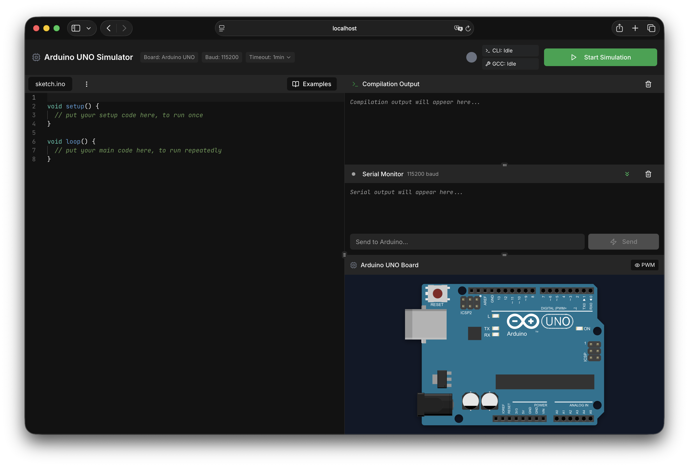
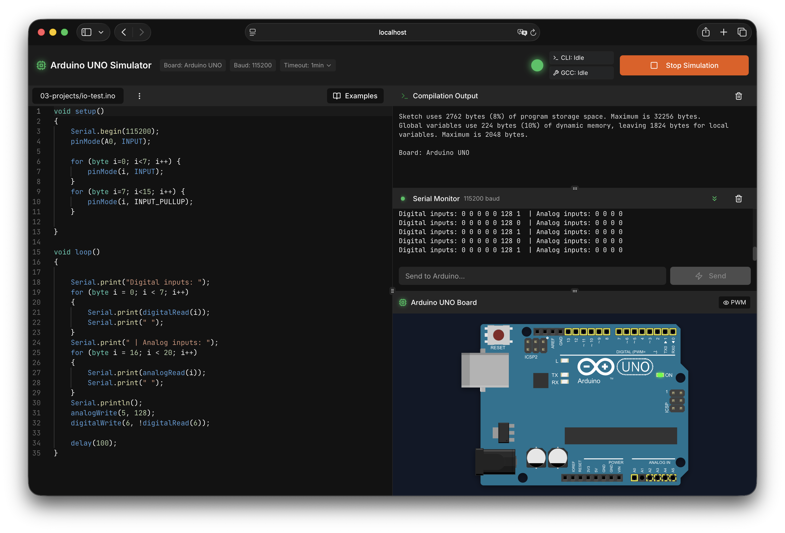
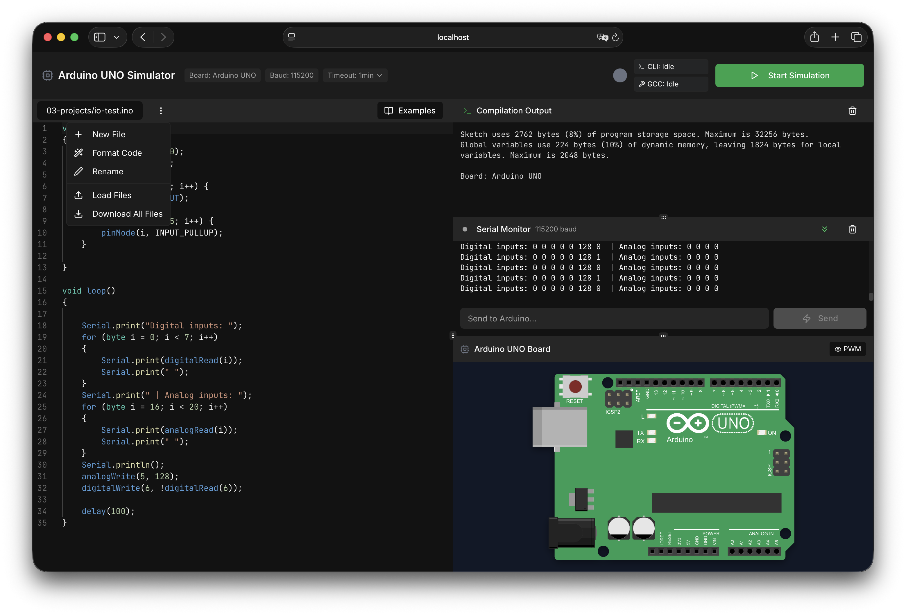

# UnoWebSim

[](https://modevio.github.io/UNOWEBSIM/)

A web-based Arduino simulator that provides an interactive code editor, compilation and Arduino Preview for Arduino sketches directly in the browser.


## Preview
<p align="center">
   
   
</p>
<p align="center">
   
</p>


## Features
- **Code Editor**: Monaco editor integration for writing Arduino sketches with syntax highlighting
- **Compilation**: Compile Arduino code directly in the browser
- **Serial Monitor**: Real-time output display from simulated Arduino execution
- **Arduino Preview**: A preview of analog/digital inputs and outputs directly in the Arduino SVG
- **Web-based**: No installation required, run entirely in the browser
- **Modern UI**: Built with React and TailwindCSS for a responsive, professional interface


## Tech Stack
- **Frontend**: React, TypeScript, Vite, TailwindCSS, Radix UI
- **Backend**: Node.js (TypeScript), Express, WebSocket support
- **Storage**: In-memory storage (PostgreSQL/Neon infrastructure prepared but not integrated yet)
- **Editor**: Monaco Editor
- **Testing**: Jest with React Testing Library
- **Build Tools**: Vite, esbuild


## Installation (only for Linux/MacOS)
### Prerequisites
- Node.js (v18 or higher)
- npm or yarn
### Setup

1. Clone the repository:
```bash
git clone https://github.com/MoDevIO/UNOWEBSIM.git
cd unowebsim
```

2. Install dependencies:
```bash
npm install
```

3. Start the dev-server:
```bash
npm run dev:full
```

This will start both the backend server and the frontend development server.


## License
MIT License - See [LICENSE](LICENSE) for details


## Contact & Support

### Getting Help
- **Issues & Bugs**: Use the [GitHub Issues](https://github.com/modevio/unowebsim/issues) tracker
- **Feature Requests**: Create an [Pull Request](https://github.com/modevio/unowebsim/pulls)
- **Questions**: Open a discussion or check existing issues

### Project Maintainers
- **Mo Tiltmann** (MoDevIO) - Couven-Gymnasium, Aachen
- **Tom Tiltmann** (ttbombadil) - Technische Hochschule, Köln


### Additional Resources
- [Arduino Official Documentation](https://www.arduino.cc/reference/)
- [Monaco Editor Documentation](https://microsoft.github.io/monaco-editor/)
- [React Documentation](https://react.dev/)