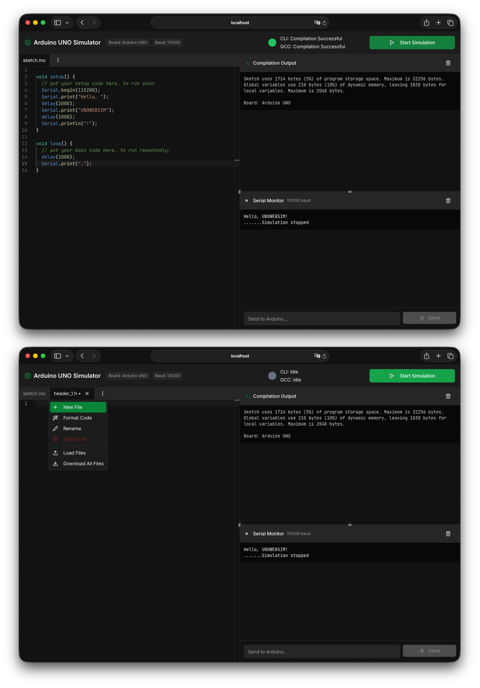

# UnoWebSim

A web-based Arduino simulator that provides an interactive code editor, compilation, and execution environment for Arduino sketches directly in the browser.


## Features

- **Code Editor**: Monaco editor integration for writing Arduino sketches with syntax highlighting
- **Compilation**: Compile Arduino code directly in the browser
- **Serial Monitor**: Real-time output display from simulated Arduino execution
- **Web-based**: No installation required, run entirely in the browser
- **Modern UI**: Built with React and TailwindCSS for a responsive, professional interface

## Screenshots



## Tech Stack

- **Frontend**: React 18, TypeScript, Vite, TailwindCSS, Radix UI
- **Backend**: Express, Node.js, WebSocket support
- **Storage**: In-Memory storage (PostgreSQL/Neon infrastructure prepared but not yet integrated)
- **Editor**: Monaco Editor
- **Testing**: Jest with React Testing Library
- **Build Tools**: esbuild, Vite

## Installation

### Prerequisites
- Node.js (v18 or higher)
- npm or yarn

### Setup

1. Clone the repository:
```bash
git clone https://git-ce.rwth-aachen.de/assistance-systems/examples/unowebsim.git
cd unowebsim
```

2. Install dependencies:
```bash
npm install
```

3. Start the development server:
```bash
npm run dev:full
```

This will start both the backend server and the frontend development server concurrently.

## Usage

### Development

- **Full stack development** (frontend + backend):
  ```bash
  npm run dev:full
  ```

- **Backend only**:
  ```bash
  npm run dev
  ```

- **Frontend only**:
  ```bash
  npm run dev:client
  ```

### Building

```bash
npm run build
```

Builds both the frontend and backend for production.

### Production

```bash
npm start
```

### Testing

- Run tests:
  ```bash
  npm test
  ```

- Run tests in watch mode:
  ```bash
  npm run test:watch
  ```

- Generate coverage report:
  ```bash
  npm run test:coverage
  ```

### Type Checking

```bash
npm run check
```

## Project Structure

```
├── client/                 # Frontend React application
│   └── src/
│       ├── components/     # React components
│       │   ├── features/   # Feature components (editor, output, monitor)
│       │   └── ui/         # Reusable UI components
│       ├── hooks/          # Custom React hooks
│       ├── lib/            # Utilities and clients
│       └── pages/          # Page components
├── server/                 # Backend Express server
│   ├── services/           # Business logic (compiler, runner)
│   ├── mocks/              # Mock implementations
│   └── routes.ts           # API routes
├── shared/                 # Shared code between client and server
│   ├── logger.ts           # Logging utilities
│   └── schema.ts           # Data schemas
├── tests/                  # Test files
└── examples/               # Example Arduino sketches
```

## Key Components

### Code Editor
Monaco-based code editor for writing Arduino sketches with syntax highlighting and intelligent suggestions.

### Compilation Service
Handles compilation of Arduino code with support for standard Arduino libraries and error reporting.

### Serial Monitor
Displays real-time output from the simulated Arduino execution, mimicking the Arduino IDE's serial monitor.

## Contributing

Contributions are welcome! Please ensure:
- Code follows the existing style
- All tests pass: `npm test`
- Type checking passes: `npm run check`
- No console errors or warnings

## License

MIT License - See LICENSE file for details

## Support

For issues, questions, or suggestions, please use the GitLab issue tracker or contact the development team.
